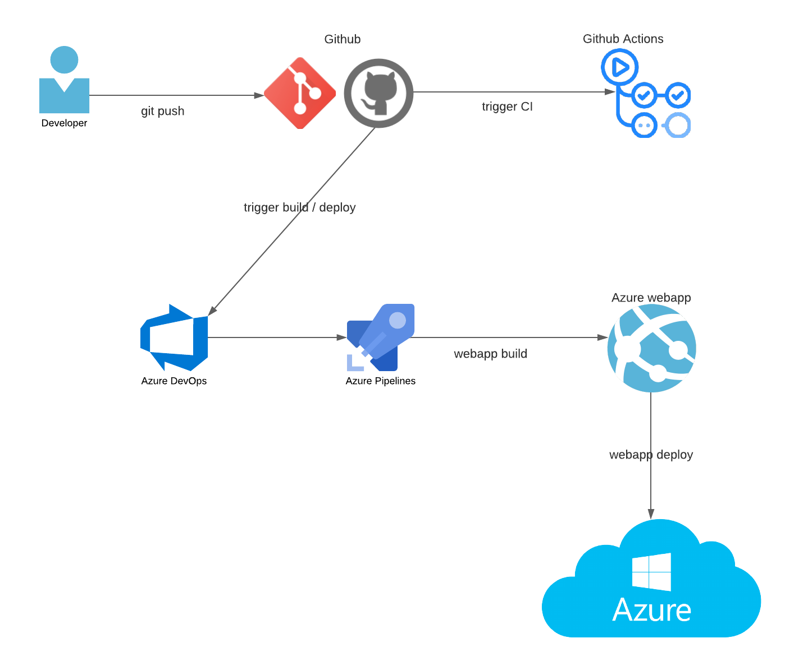

# nd082-ent-project-2
Proyecto 2 para DevOps Engineer for Microsoft Azure Nanodegree Program

[](https://github.com/adelriob/nd082-ent-project-2/actions/workflows/pythonapp.yml)

[](https://dev.azure.com/adelriob0110/Project-2/_build/latest?definitionId=4&branchName=main)

# Overview

This is the second project of the course "DevOps Engineer for Microsoft Azure Nanodegree Program". With this project, the CI / CD process will be carried out through Azure Pipelines pipes.

## Project Plan

* A link to a Trello board for the project
    * https://trello.com/b/v1p899YD/projectflask
* A link to a spreadsheet that includes the original and final project plan
    * https://github.com/adelriob/nd082-ent-project-2/blob/main/project-management-template.xlsx

## Instructions

* Architectural Diagram (Shows how key parts of the system work)



* Project cloned into Azure Cloud Shell

    * Open Azure Cloud Shell, create a SSH key pair by: ssh-keygen -t rsa;
    
    

    * Copy and paste the public SSH key to github.com -> Settings -> SSH and GPG Keys -> New SSH Key
    
    
    
    * Clone repository

    

* Project running on Azure App Service

    * Go to directory: cd nd082-ent-project-2/

    

    * Create Webapp on Azure: az webapp up --sku F1 --name adelriob-flask --location "East US"

    

    

    * Modify make_predict_azure_app.sh with the webapp name adelriob-flask in the POST target line

    

* Passing tests that are displayed after running the `make all` command from the `Makefile`

    

    

* Output of a test run

    

* Successful deploy of the project in Azure Pipelines.  [Note the official documentation should be referred to and double checked as you setup CI/CD](https://docs.microsoft.com/en-us/azure/devops/pipelines/ecosystems/python-webapp?view=azure-devops).


* Running Azure App Service from Azure Pipelines automatic deployment

* Successful prediction from deployed flask app in Azure Cloud Shell.  [Use this file as a template for the deployed prediction](https://github.com/udacity/nd082-Azure-Cloud-DevOps-Starter-Code/blob/master/C2-AgileDevelopmentwithAzure/project/starter_files/flask-sklearn/make_predict_azure_app.sh).
The output should look similar to this:

```bash
udacity@Azure:~$ ./make_predict_azure_app.sh
Port: 443
{"prediction":[20.35373177134412]}
```

* Output of streamed log files from deployed application 

## Enhancements

<TODO: A short description of how to improve the project in the future>

## Demo 

<TODO: Add link Screencast on YouTube>


