# nd082-ent-project-2
Proyecto 2 para DevOps Engineer for Microsoft Azure Nanodegree Program

# Overview

This is the second project of the course "DevOps Engineer for Microsoft Azure Nanodegree Program". With this project, the CI / CD process will be carried out through Azure Pipelines pipes.

## Project Plan

* A link to a Trello board for the project
    * https://trello.com/b/v1p899YD/projectflask
* A link to a spreadsheet that includes the original and final project plan
    * https://github.com/adelriob/nd082-ent-project-2/blob/main/project-management-template.xlsx

## Instructions

* Architectural Diagram (Shows how key parts of the system work)

* Project cloned into Azure Cloud Shell

    * Open Azure Cloud Shell, create a SSH key pair by: ssh-keygen -t rsa;
    
    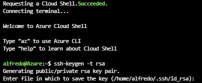

    * Copy and paste the public SSH key to github.com -> Settings -> SSH and GPG Keys -> New SSH Key
    
    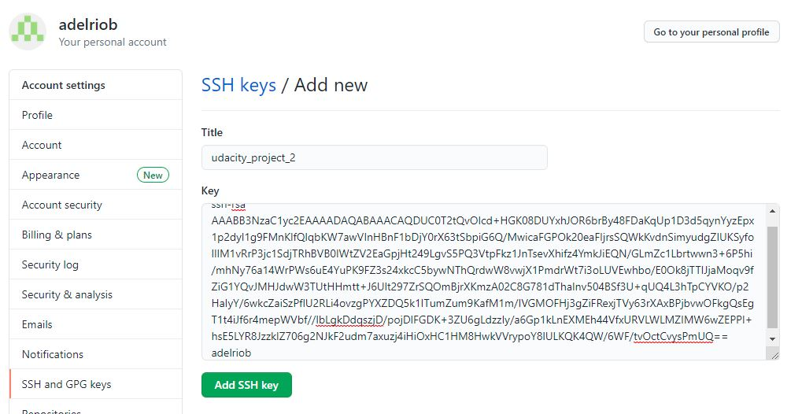
    
    * Clone repository

    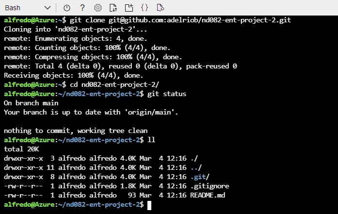

* Project running on Azure App Service

    * Go to directory: cd nd082-ent-project-2/flask-sklearn 

    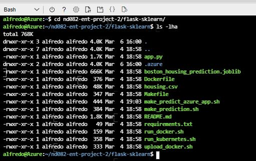

    * Create virtual environment

    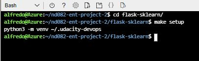

    * Go to virtual environment

    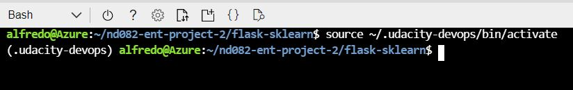

    * Run make all

    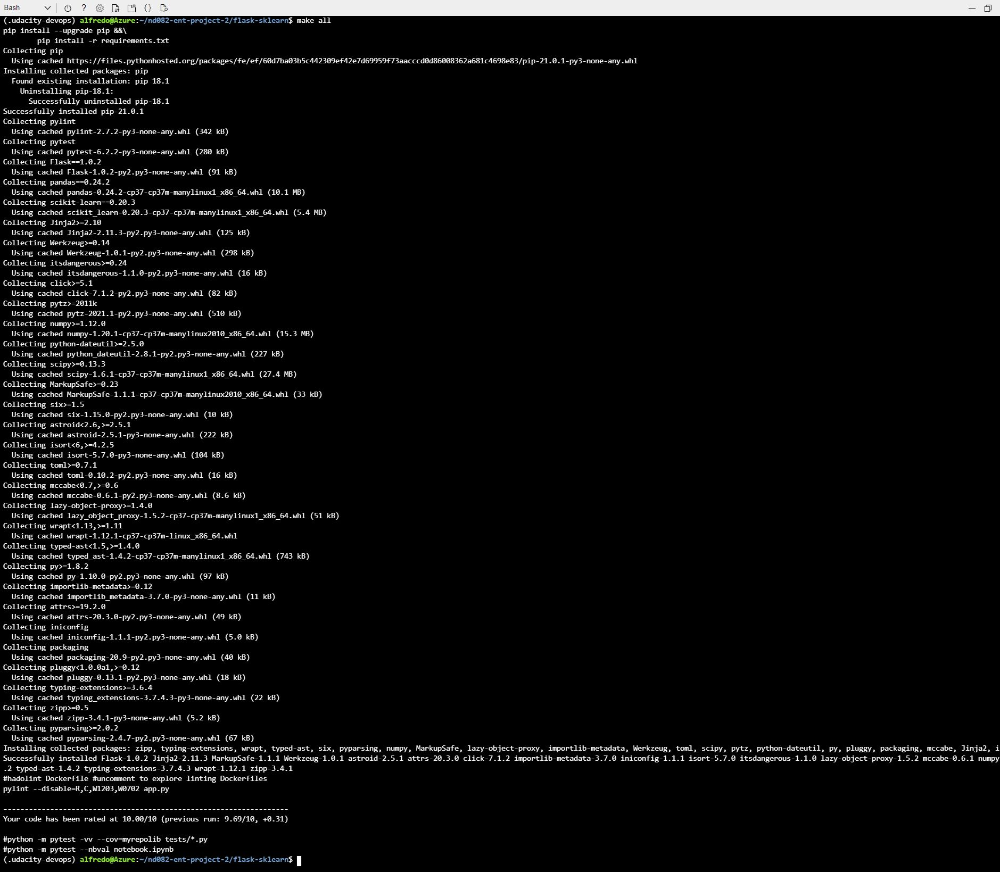

    * Run app to verify

    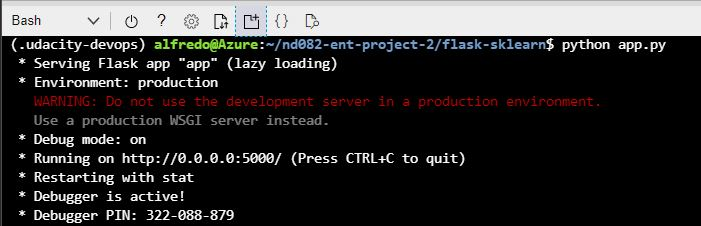

    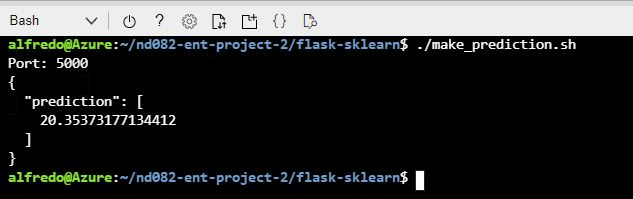

    * Create Webapp on Azure: az webapp up --sku FREE --name adelriob-flask --location "East US" 

    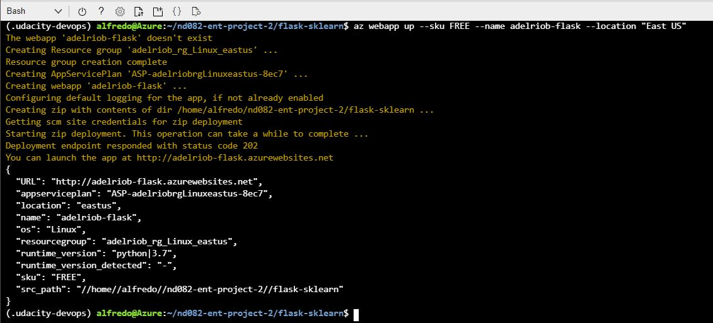

    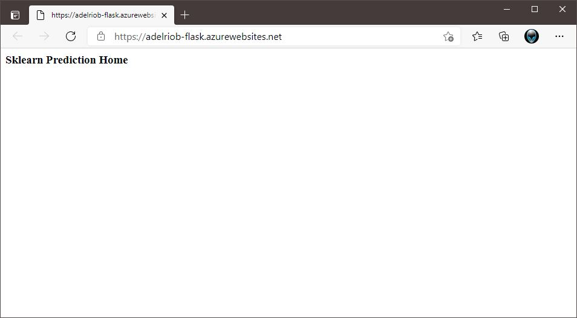

    * Modify make_predict_azure_app.sh with the webapp name adelriob-flask in the POST target line

    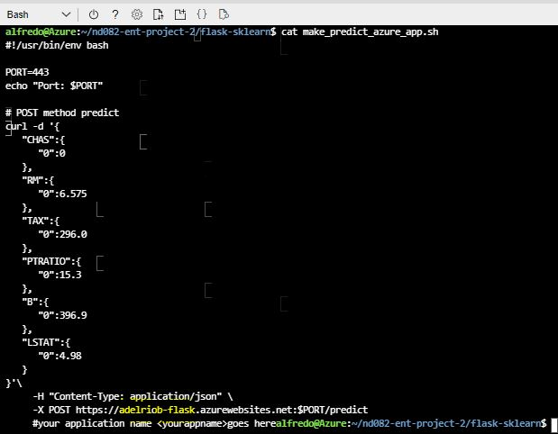

    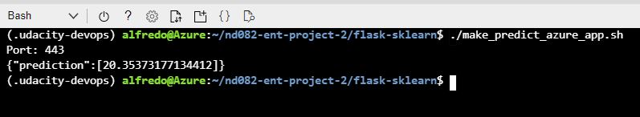

    * Performance TEST
    We use LOCUST to performance test of the apply.

        * Install Locust: pip install locust

        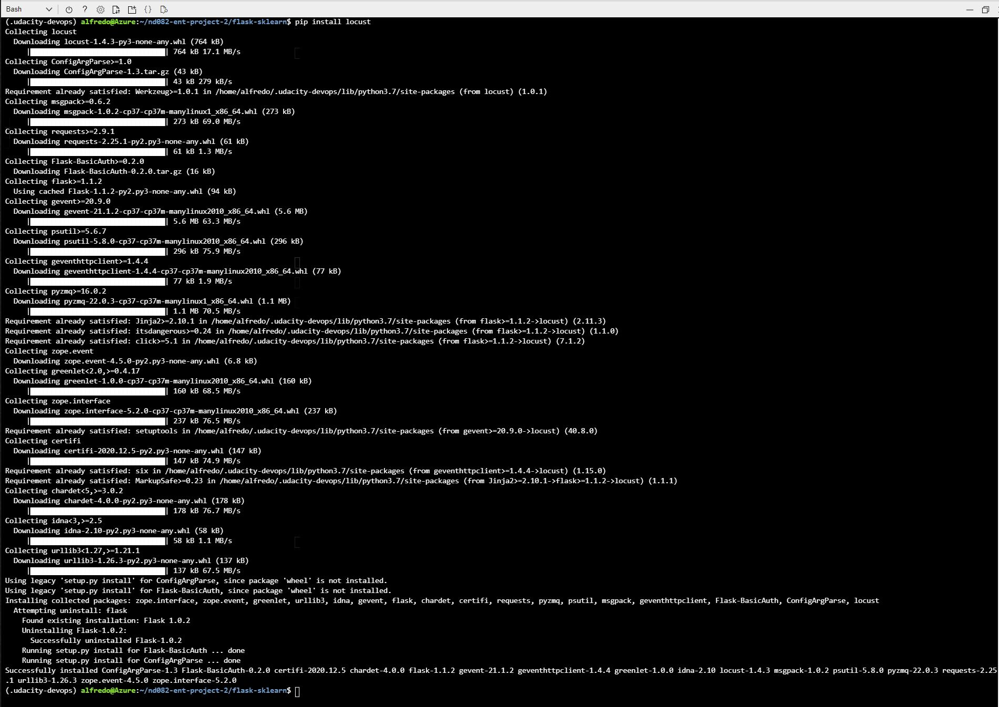

        * Run Locust

        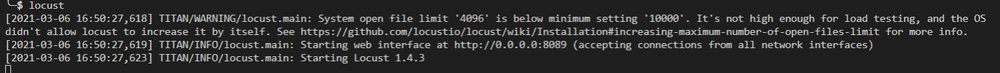

        * Go to link: http://localhost:8089/ and simulate users

        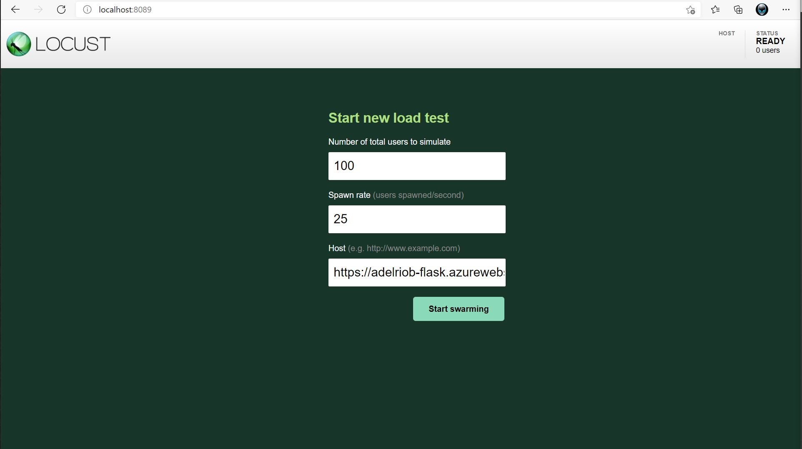

        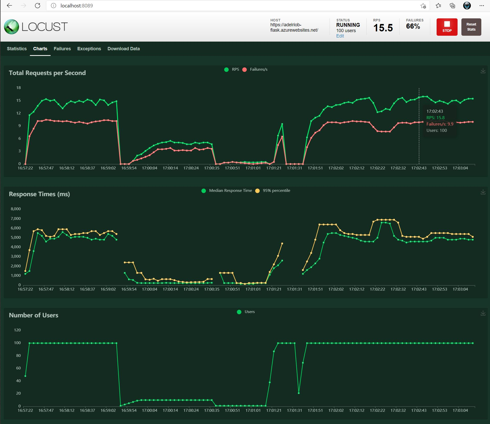

    * Github Actions and Azure Pipelines status

    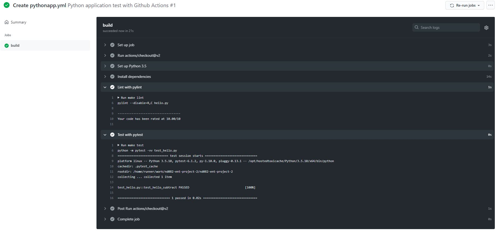

    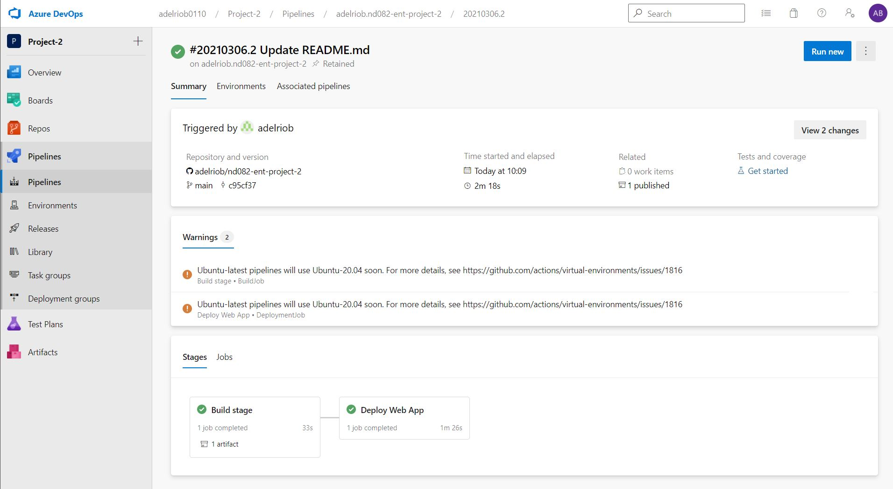

## Enhancements

In the future, the application will be moved to Azure Repos to keep all the flow from Azure Cloud.

## Demo 

Look at this demo of the application from youtube, below the link [HERE](https://youtu.be/0jcIIQIIKQI).

